# 🛍️ E-Commerce Customer Churn Analysis & Segmentation

> Predicting who leaves, understanding why, and grouping customers into segments that actually inform retention strategy.

---

## 🎯 The Problem

E-commerce businesses lose revenue every time a customer churns — and it's far cheaper to retain an existing customer than acquire a new one. But not all churners look alike, and blanket retention campaigns waste money on customers who were never at risk.

**This project asks two questions:**
1. What behaviors actually correlate with churn?
2. Can customers be grouped into segments so retention efforts can be targeted instead of blasted at everyone?

**Quick answer:** Out of **49,910 customers**, **28.91% churned**. Cart abandonment is the single strongest churn signal in this dataset, and two customer segments — Inactive Customers and Window Shoppers — churn at roughly **double the rate** of the rest of the base.

---

## 📊 Dataset

`ecommerce_customer_churn_dataset.csv` — customer demographics, engagement metrics (login frequency, session duration, email open rate, social engagement), purchase behavior (total purchases, cart abandonment, lifetime value), and a binary `Churned` label.

---

## 🧹 Data Cleaning

- Handled missing values via median imputation (target column explicitly excluded)
- Removed duplicate records
- Filtered invalid entries (negative purchases, out-of-range ages, cart abandonment >100%)
- Final clean dataset: **49,910 customers**

---

## 📈 Exploratory Data Analysis

### Churn Overview
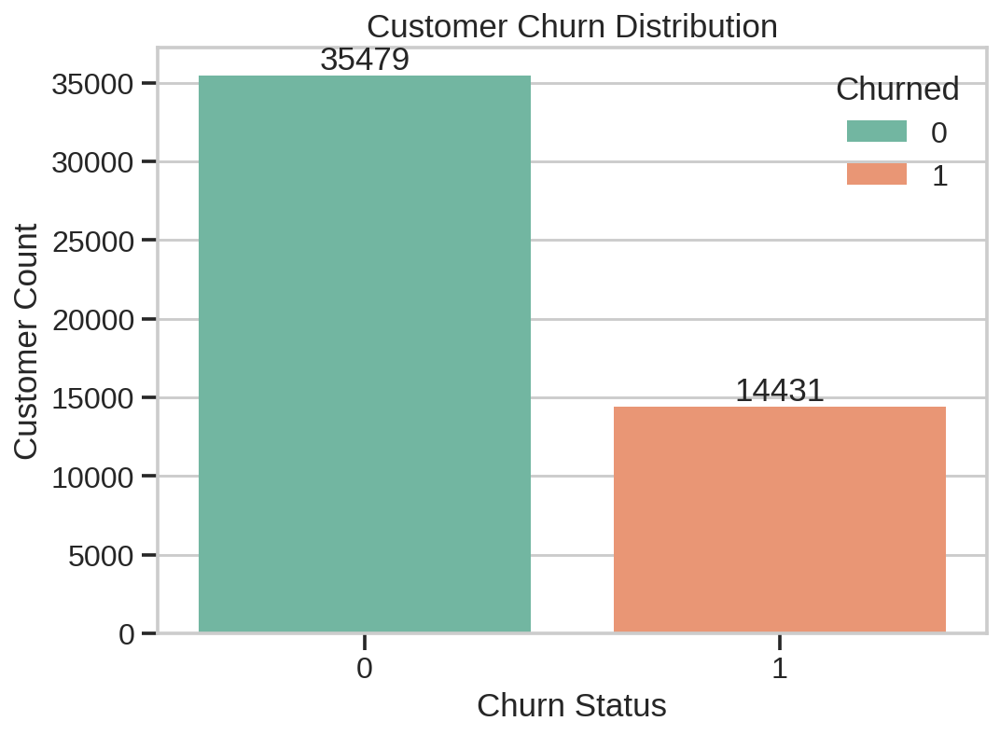

*28.91% of customers in this dataset churned — this is the baseline rate every segment comparison below is measured against.*

### Customer Value & Purchase Patterns
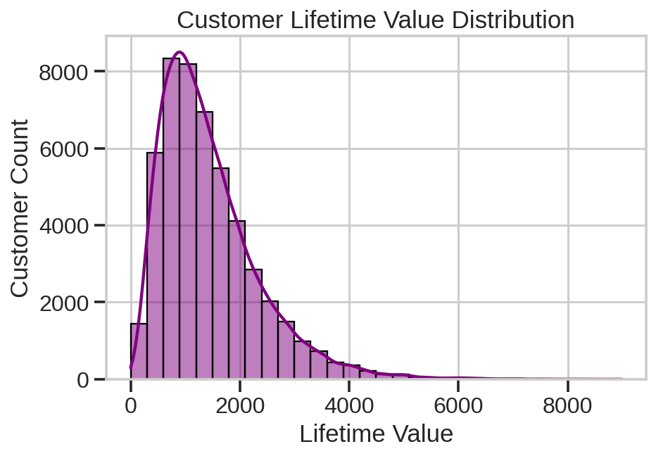
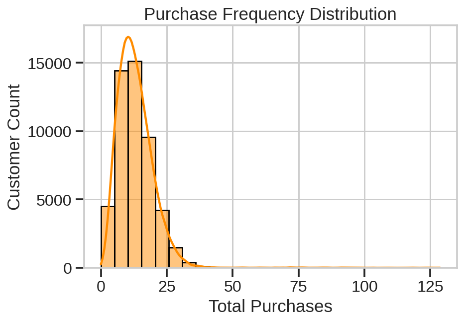

*Average lifetime value across the base is $1,440.58, with average purchases per customer at 13.13 — both distributions show a long right tail, meaning a small group of high-value customers pulls the average up. This is exactly the kind of pattern that makes segmentation more useful than relying on averages alone.*

### Customer Activity Levels
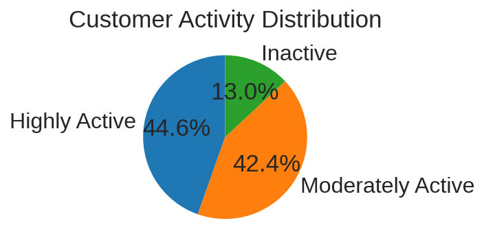

### What Separates Churners from Retained Customers
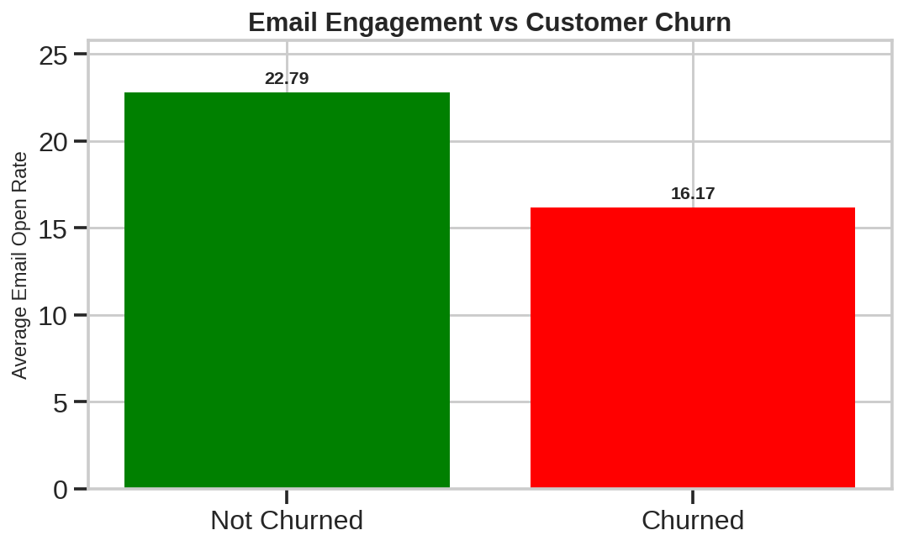
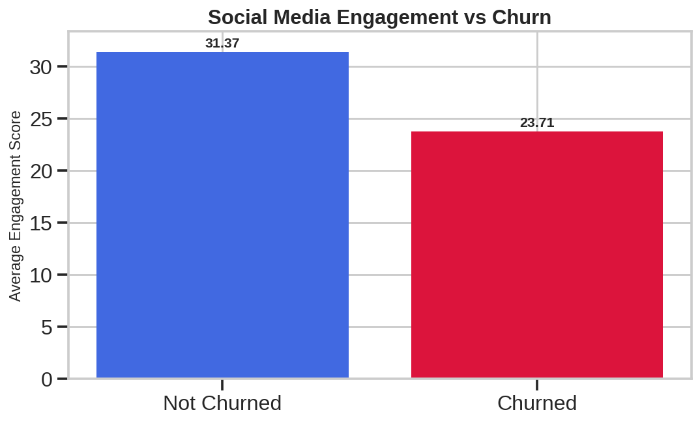
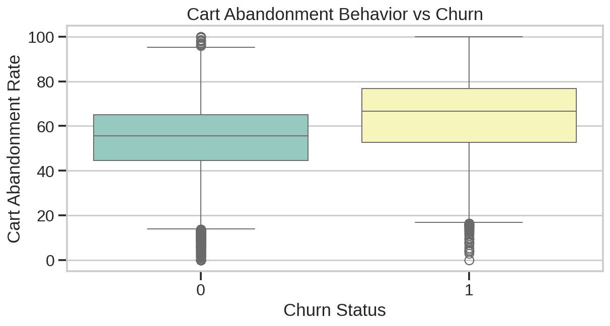

*Churned customers show consistently lower email and social engagement, and visibly higher cart abandonment rates — clear behavioral warning signs that show up before a customer fully leaves.*

### Correlation Analysis
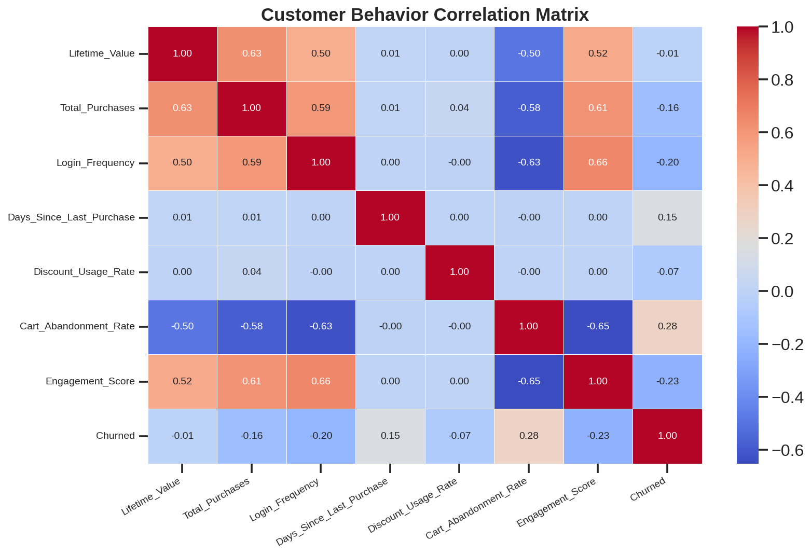

**Strongest relationships with churn:**
| Feature | Correlation with Churn |
|---|---|
| Cart Abandonment Rate | **+0.28** (strongest single driver) |
| Engagement Score | −0.23 |
| Login Frequency | −0.20 |
| Total Purchases | −0.16 |
| Days Since Last Purchase | +0.15 |

*Cart abandonment is the clearest single behavioral red flag — customers who repeatedly abandon carts are meaningfully more likely to churn than any other signal in this dataset.*

---

## 🧮 Customer Segmentation (K-Means Clustering)

### Choosing the Right Number of Clusters
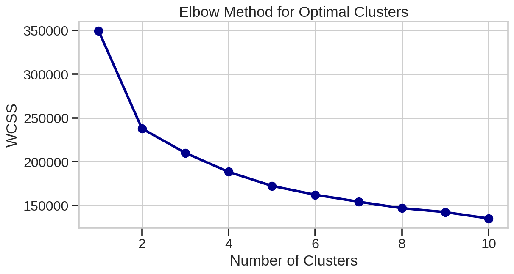

*The elbow method pointed to k=5 as a reasonable balance between simplicity and cluster distinctiveness.*

**Cluster quality check:** Silhouette Score = **0.177**, indicating moderate cluster overlap — customer behavior in this dataset trends more continuous than sharply segmented. Stated plainly rather than hidden, because that's what separates a credible analysis from a cherry-picked one.

### The Five Segments
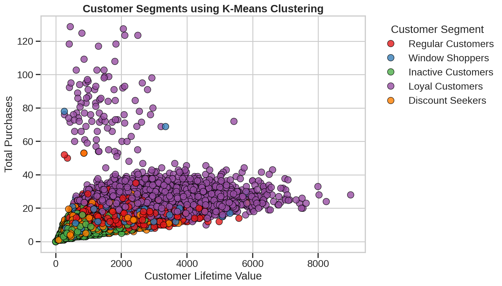
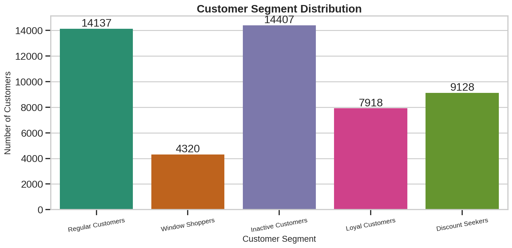

Segments were labeled programmatically by ranking clusters against actual behavioral averages (Lifetime Value, Purchases, Login Frequency, Discount Usage, Cart Abandonment, Days Since Last Purchase) — not hardcoded — so labels reflect real cluster behavior rather than assumed order.

---

## 💡 Key Business Insight

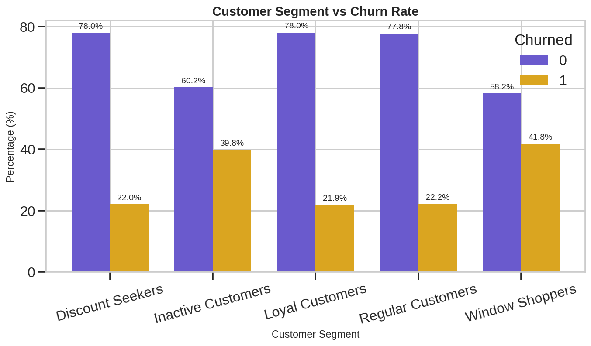

| Segment | Churn Rate |
|---|---|
| Window Shoppers | **41.81%** |
| Inactive Customers | **39.80%** |
| Discount Seekers | 22.04% |
| Regular Customers | 22.22% |
| Loyal Customers | 21.95% |

**Window Shoppers and Inactive Customers churn at nearly double the rate of the other three segments.** Retention spend should concentrate here rather than being spread evenly across the whole customer base — the other three segments are already performing close to the account-wide baseline and don't need the same urgency.

---

## 🚀 What Would Add More Value (Next Steps)

### 1. A churn prediction model
This project is descriptive (what happened) and segmentation-based (who's similar). Adding a supervised model — logistic regression or random forest predicting `Churned` — with a feature importance chart would extend this from "exploratory" to "predictive," a meaningfully more advanced signal for a portfolio.

### 2. A cost-benefit framing
Example: *Window Shoppers and Inactive Customers make up roughly [X]% of the customer base but account for a disproportionate share of churn. A 10% reduction in churn within just these two segments would retain approximately [Y] customers worth an estimated $[Z] in lifetime value.* Framing findings in dollar terms is what makes non-technical reviewers actually engage with a data project.

### 3. An interactive element (optional, high-impact)
A small Streamlit or Plotly Dash app letting someone filter by segment and see live churn stats turns a static notebook into something people can play with — this consistently drives more engagement than static charts alone.

### 4. Native platform posting
If sharing on LinkedIn/X, embed 1-2 of the strongest chart images (the segment-vs-churn chart above is the best candidate) directly in the post rather than only linking to the repo — platforms deprioritize outbound links in their feed algorithms, so native images get significantly more reach.

---

## 🛠️ Tools Used
Python · pandas · numpy · matplotlib · seaborn · scikit-learn (StandardScaler, KMeans, silhouette_score)

## 📁 How to Run
```bash
pip install -r requirements.txt
```
Place the dataset in `data/ecommerce_customer_churn_dataset.csv`, then run `ecommerce_churn_kmeans_analysis.ipynb`.
